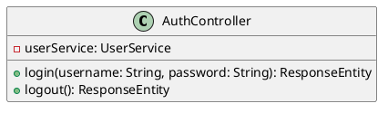

# PlantUML Level 3 Component Diagrams - Configuration Guide

## Overview

This configuration automatically generates PlantUML class diagrams for each Level 3 component in the OCI DevOps project. Each component gets its own dedicated `.puml` file organized by category (Controllers, Services, Repositories).

## Architecture

The diagram generation system consists of:

1. **PlantUMLDiagramGenerator.java** - Main utility class that scans Java packages and generates diagrams
2. **Maven Plugin Configuration** - Integrated into `pom.xml` for easy execution
3. **Generate Scripts** - Convenience scripts for Windows (.bat) and Unix (.sh)
4. **Organized Output** - Diagrams saved in categorized subdirectories

## Component Categories

### Controllers (6 components)
Handles HTTP request routing and response handling:

```
Controllers/
├── AuthController.puml          - Authentication and login flows
├── TaskController.puml          - Task CRUD operations
├── DashboardController.puml     - Dashboard view rendering
├── UserController.puml          - User management endpoints
├── ToDoItemController.puml      - Todo item REST API
└── ToDoItemBotController.puml   - Telegram bot integration
```

**Base Package**: `com.springboot.MyTodoList.controller`

### Services (3 components)
Business logic and external integrations:

```
Services/
├── GeminiService.puml           - Google Gemini AI integration
├── TelegramSummaryService.puml  - Telegram summary generation
└── TelegramMessageService.puml  - Telegram message handling
```

**Base Package**: `com.springboot.MyTodoList.service`

### Repositories (5 components)
Data access and persistence layer:

```
Repositories/
├── UserRepository.puml                  - User data persistence
├── TaskRepository.puml                  - Task data persistence
├── TelegramMessageRepository.puml       - Telegram message storage
├── TelegramSummaryRepository.puml       - Telegram summary storage
└── ToDoItemRepository.puml              - Todo item storage
```

**Base Package**: `com.springboot.MyTodoList.repository`

## Quick Start

### Option 1: Using Generated Scripts (Recommended)

**Windows:**
```bash
cd architecture\plantUML
.\generate-diagrams.bat
```

**Unix/Linux/macOS:**
```bash
cd architecture/plantUML
bash generate-diagrams.sh
```

### Option 2: Direct Maven Command

```bash
cd MtdrSpring/backend
mvn clean compile exec:java -Dexec.mainClass="com.springboot.MyTodoList.util.PlantUMLDiagramGenerator"
```

### Option 3: Run During Maven Build

To automatically generate diagrams as part of the build process:

```bash
cd MtdrSpring/backend
mvn clean package
```

The `exec-maven-plugin` will automatically run the diagram generator after compilation.

## Generated Output

All diagrams are saved as `.puml` files in the `architecture/plantUML/` directory with the following structure:

```
architecture/plantUML/
├── Controllers/
│   ├── AuthController.puml
│   ├── DashboardController.puml
│   ├── TaskController.puml
│   ├── ToDoItemBotController.puml
│   ├── ToDoItemController.puml
│   └── UserController.puml
├── Repositories/
│   ├── TaskRepository.puml
│   ├── TelegramMessageRepository.puml
│   ├── TelegramSummaryRepository.puml
│   ├── ToDoItemRepository.puml
│   └── UserRepository.puml
├── Services/
│   ├── GeminiService.puml
│   ├── TelegramMessageService.puml
│   └── TelegramSummaryService.puml
├── Controllers/
│   └── ...
├── generate-diagrams.bat         - Windows batch script
├── generate-diagrams.sh          - Unix shell script
├── README.md                     - This file
└── .gitignore                    - Git ignore patterns
```

## Diagram Content

Each `.puml` file contains a complete PlantUML class diagram showing:
- Class definitions
- Class attributes (properties)
- Method signatures
- Inheritance relationships
- Interface implementations
- Dependencies between classes

Example structure of a generated .puml file:


## Configuration Details

### Component Mapping

The `PlantUMLDiagramGenerator` maps each component to its Java package:

```java
// Controllers
"controller/AuthController" → com.springboot.MyTodoList.controller.AuthController
"controller/TaskController" → com.springboot.MyTodoList.controller.TaskController
// ... and so on

// Services
"service/GeminiService" → com.springboot.MyTodoList.service.GeminiService
// ... and so on

// Repositories
"repository/UserRepository" → com.springboot.MyTodoList.repository.UserRepository
// ... and so on
```

### Customization

To modify the component list, edit `MtdrSpring/backend/src/main/java/com/springboot/MyTodoList/util/PlantUMLDiagramGenerator.java`

Add or modify entries in the `COMPONENTS` list:

```java
private static final List<ComponentConfig> COMPONENTS = List.of(
    new ComponentConfig("controller/YourComponent", "Controllers/YourComponent.puml"),
    // ... add your custom components here
);
```

## Dependencies

- **plantuml-generator-util** - Scans Java bytecode and generates PlantUML syntax
- **Maven exec-maven-plugin** - Executes Java classes from Maven
- **Spring Boot 3.5.6** - Application framework

## Troubleshooting

### Problem: Diagrams not generated
**Solution**: 
1. Ensure Maven is installed: `mvn --version`
2. Run clean compile first: `mvn clean compile`
3. Check for compilation errors in the Java project

### Problem: Permission denied (Unix)
**Solution**: Make the script executable:
```bash
chmod +x architecture/plantUML/generate-diagrams.sh
```

### Problem: Maven classpath issues
**Solution**: 
1. Delete `target/` directory: `rm -rf target/` (Unix) or `rmdir /s target` (Windows)
2. Run `mvn clean compile` to rebuild

### Problem: Files not found in expected location
**Solution**: 
1. Verify the diagram generator is writing to correct output directory
2. Check the `OUTPUT_DIR` variable in `PlantUMLDiagramGenerator.java`
3. Ensure `architecture/plantUML/` directory exists and is writable

## Version History

- **v1.0** - Initial configuration with 14 Level 3 components (6 Controllers, 3 Services, 5 Repositories)

## Integration with CI/CD

To integrate with your CI/CD pipeline, add to your pipeline configuration:

```yaml
- name: Generate PlantUML Diagrams
  run: |
    cd MtdrSpring/backend
    mvn exec:java -Dexec.mainClass="com.springboot.MyTodoList.util.PlantUMLDiagramGenerator"
  
- name: Commit diagrams
  run: |
    git add architecture/plantUML/*.puml
    git commit -m "Generated PlantUML component diagrams" || echo "No changes to commit"
```

## References

- [PlantUML Documentation](https://plantuml.com/)
- [plantuml-generator-util GitHub](https://github.com/elnarion/plantuml-generator)
- [Maven Exec Plugin](https://www.mojohaus.org/exec-maven-plugin/)
